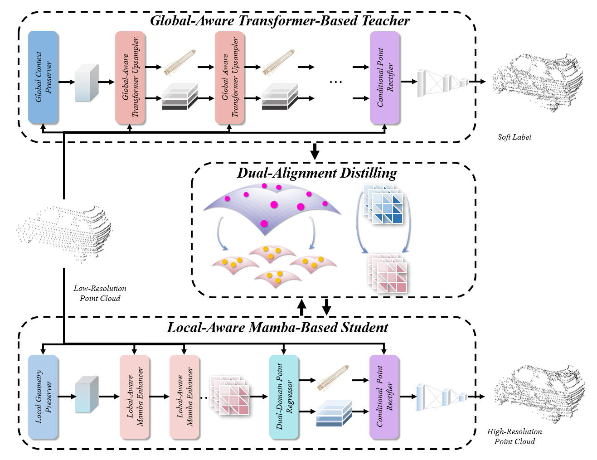
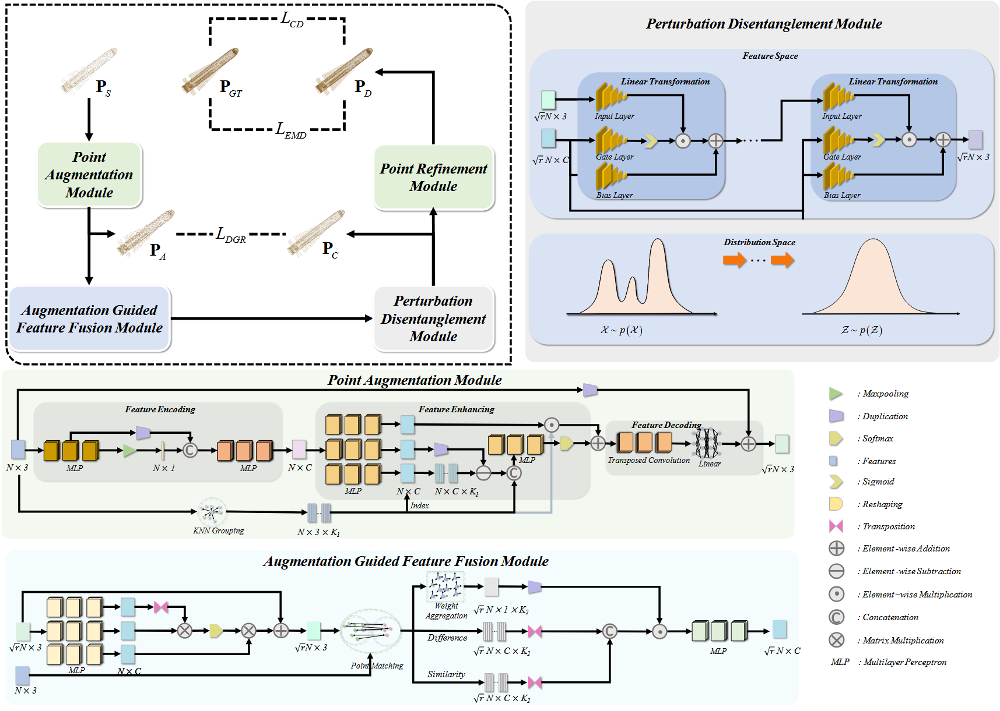
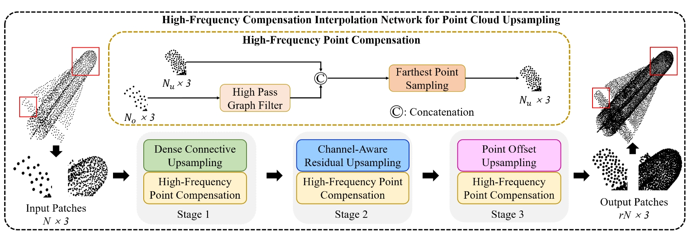








I am Xiaolong Tang. I received the B.E. degree in Electronic and Information Engineering from Communication University of Zhejiang, Hangzhou, China, in 2022. I am currently working toward the Ph.D. degree at Ningbo University, Ningbo, China. 

My current research interests focus on 3D point cloud upsampling and quality assessment.

I have published 5 papers with total <a href='https://scholar.google.com/citations?user=DhtAFkwAAAAJ'>google scholar citations <strong>260000+</strong></a> (You can also use google scholar badge ).

# 🔥 News
- *2022.02*: &nbsp;🎉🎉 Lorem ipsum dolor sit amet, consectetur adipiscing elit. Vivamus ornare aliquet ipsum, ac tempus justo dapibus sit amet. 
- *2022.02*: &nbsp;🎉🎉 Lorem ipsum dolor sit amet, consectetur adipiscing elit. Vivamus ornare aliquet ipsum, ac tempus justo dapibus sit amet. 

# 📝 Publications 
<!-- TCE -->

📝2026 TCE 

[PU-T2M: Heterogeneous Knowledge Distilling Network from Transformer to Mamba for Lightweight Point Cloud Upsampling](https://ieeexplore.ieee.org/abstract/document/11520876), **Xiaolong Tang**, Feng Shao; Xiongli Chai; Hangwei Chen; Zhongjie Zhu; Zhiyi Mo
, *IEEE Transactions on Consumer Electronics*

<!-- Displays -->

📝2025 Displays

[PU-MG: Mutual guidance framework for Point Cloud Upsampling](https://https://www.sciencedirect.com/science/article/pii/S0141938225003075), **Xiaolong Tang**, Feng Shao; Baoyang Mu, Hangwei Chen, *Displays*

<!-- TIM -->

📝2024 TIM

[HFCI-PU: High-Frequency Compensation Interpolation Network for Point Cloud Upsampling](https://ieeexplore.ieee.org/document/10755974), **Xiaolong Tang**, Feng Shao; Xiongli Chai; Hangwei Chen; Qiuping Jiang; Xiangchao Meng, *IEEE Transactions on Instrumentation and Measurement*

<!-- [**Project**](https://scholar.google.com/citations?view_op=view_citation&hl=zh-CN&user=DhtAFkwAAAAJ&citation_for_view=DhtAFkwAAAAJ:ALROH1vI_8AC) <strong></strong>
- Lorem ipsum dolor sit amet, consectetur adipiscing elit. Vivamus ornare aliquet ipsum, ac tempus justo dapibus sit amet. 

- [Lorem ipsum dolor sit amet, consectetur adipiscing elit. Vivamus ornare aliquet ipsum, ac tempus justo dapibus sit amet](https://github.com), A, B, C, **CVPR 2020** -->

<!-- # 🎖 Honors and Awards
- *2025.6* Lorem ipsum dolor sit amet, consectetur adipiscing elit. Vivamus ornare aliquet ipsum, ac tempus justo dapibus sit amet. 
- *2021.09* Lorem ipsum dolor sit amet, consectetur adipiscing elit. Vivamus ornare aliquet ipsum, ac tempus justo dapibus sit amet.  -->

<!-- # 📖 Educations
- *2019.06 - 2022.04 (now)*, Lorem ipsum dolor sit amet, consectetur adipiscing elit. Vivamus ornare aliquet ipsum, ac tempus justo dapibus sit amet. 
- *2015.09 - 2019.06*, Lorem ipsum dolor sit amet, consectetur adipiscing elit. Vivamus ornare aliquet ipsum, ac tempus justo dapibus sit amet.  -->

<!-- # 💬 Invited Talks
- *2021.06*, Lorem ipsum dolor sit amet, consectetur adipiscing elit. Vivamus ornare aliquet ipsum, ac tempus justo dapibus sit amet. 
- *2021.03*, Lorem ipsum dolor sit amet, consectetur adipiscing elit. Vivamus ornare aliquet ipsum, ac tempus justo dapibus sit amet.  \| [\[video\]](https://github.com/) -->

<!-- # 💻 Internships
- *2019.05 - 2020.02*, [Lorem](https://github.com/), China. -->